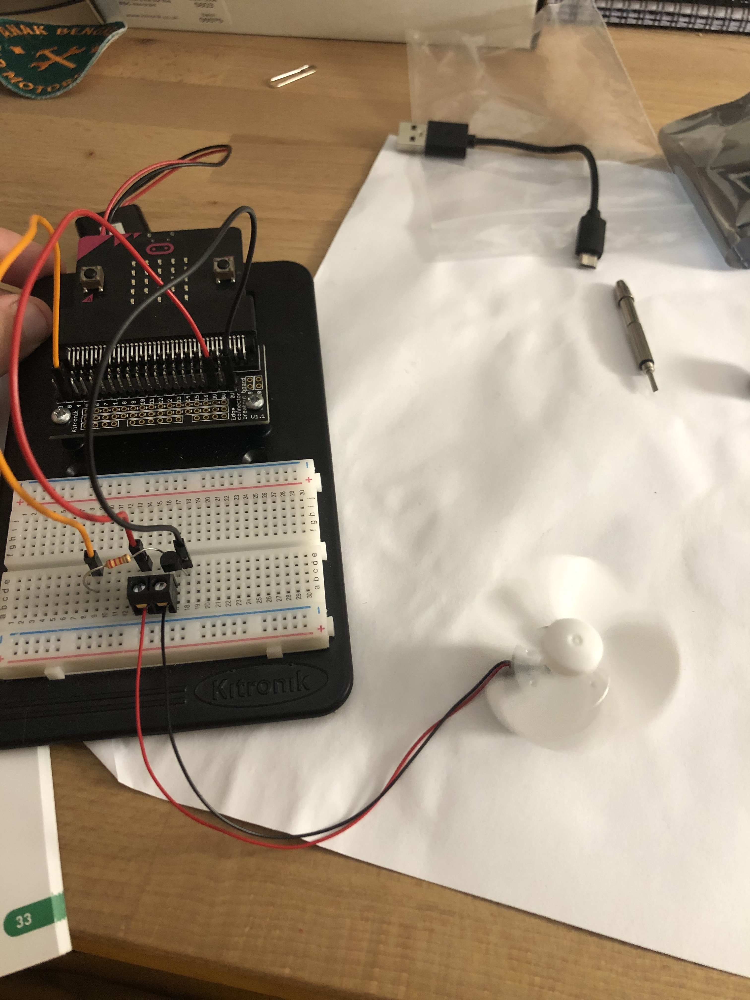

# Inventor Kit Experiments

*Markdown reference: https://guides.github.com/features/mastering-markdown/*

## Instructions ##

*For a selection of 5 inventor kit experiments that you choose, fill out the following sections.

### Experiment name ###

1. Say 'hello' with the microbit.

#### Photo of completed project ####

Experement 1 pressing button a to trigger the led screen.

#### Reflection ####

In this experiment, something new to me was or something I learned was that the micro bit has external pins that are for the buttons, this is very useful as the microbit codeing builder is set up to make useing the A & B buttons a bit easier than using any other. This may be helpful in later projects.The basis of this experement is just to use some buttons but it also introduces us to the bread board and how that works.  

This experiment could be the basis of a real world application such as ANY BUTTON ANYWHERE. 

### Experiment name ###

2. Using a Light Sensor & Analog Inputs 

#### Photo of completed project ####

Shining light on phototransister to display sun on led display.

#### Reflection ####

In this experiment, something new to me was or something I learned was logic in code. This experement introduced us to digital logic and how to use it in the make code editor. As the editor is its own type of language learning the intricusys of how logic is used in the editor is quite important to get the most functionality out of the microbit. I will also be needed in later projects most likely.

This experiment could be the basis of a real world application such as in your phone! What? Yes when your phone is on its screen and you flip it over and it atomaticaly lights up this is the result of a phototransistor.

### Experiment name ###

3. Dimming an LED Using a Potentiometer.

#### Photo of completed project ####

Light in dimmed state and applyed code.

#### Reflection ####

In this experiment, something new to me was or something I learned was using variables, in the code for this experiment a variable was used this was done so that an external button could be used this the potentiometer. i was also introduced to how the wire specific componants such as the potentiometer. 

This experiment could be the basis of a real world application such as a simple dimmable light switch in your house.

### Experiment name ###

4. Using a Transistor to drive a motor.

#### Photo of completed project ####

Fan running at high speed.

#### Reflection ####

In this experiment, something new to me was or something I learned was pulse width modulation, this was explaned in class too but the use of PWM with math and logic in the code can create different effects with componates like a motor. EG slowing down and speeding up again. 

This experiment could be the basis of a real world application such as an electric motor in a toy car. A radio would recive the input value an this would be applyed to the motor using PWM.

### Experiment name ###

5. Using the Accelerometer

#### Photo of completed project ####

Tilting the micro bit to change the speed of the fan.

#### Reflection ####

In this experiment, something new to me was or something I learned was how to use the inbult accelerometer. The micro bit has an accelerometer built in and as again has its onw way to use it in the code, in doing this experement I learned how to use this code.

This experiment could be the basis of a real world application such as may of the car racing video games and even consoles such as the wii.

