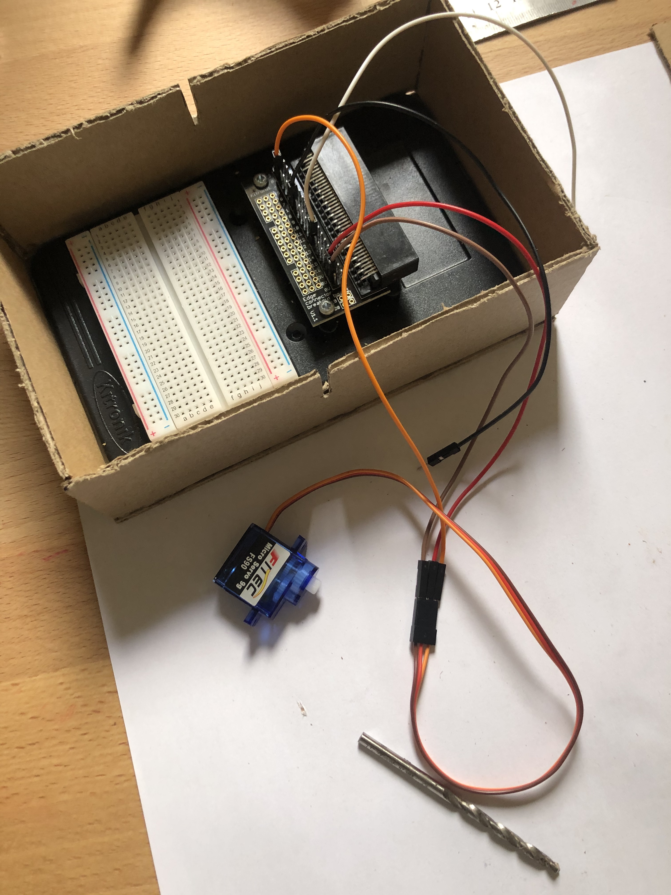
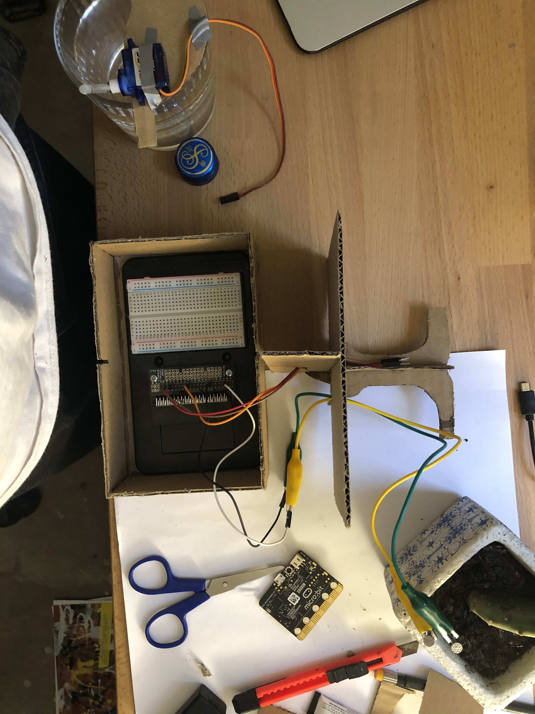

# Assessment 1: Replication project

*Fill out the following workbook with information relevant to your project.*

*Markdown reference:* [https://guides.github.com/features/mastering-markdown/](http://guides.github.com/features/mastering-markdown/)

## Replication project choice ##
Plant Watering

## Related projects ##
*Find about 6 related projects to the project you choose. A project might be related through  function, technology, materials, fabrication, concept, or code. Don't forget to place an image of the related project in the* `replicationproject` *folder and insert the filename in the appropriate places below. Copy the markdown block of code below for each project you are showing, updating the number* `1` *in the subtitle for each.*

### Related project 1 ###
Soil moisture

https://makecode.microbit.org/projects/soil-moisture/code

This project is related to mine because it is a prelimanary fundimental part. This soil moisture measuring is one of the key functions of my project and I used this resource to aid in my own build.

### Related project 2 ###
Cardboard and microbit dinosaur

https://www.youtube.com/watch?v=zDyJhbDgcXI At 4:20 an explination and demistraion of this project is shown. 
https://www.youtube.com/watch?v=795JntPTa-w Additional video of it being put together. 

This project is related to mine because it is made of a simmiler construction and made with the microbit.

## Reading reflections ##
*Reflective reading is an important part of actually making your reading worthwhile. Don't just read the words to understand what they say: read to see how the ideas in the text fit with and potentially change your existing knowledge and maybe even conceptual frameworks. We assume you can basically figure out what the readings mean, but the more important process is to understand how that changes what you think, particularly in the context of your project.*

*For each of the assigned readings, answer the questions below.*

### Reading: Don Norman, The Design of Everyday Things, Chapter 1 (The Psychopathology of Everyday Things) ###

*What I thought before: Describe something that you thought or believed before you read the source that was challenged by the reading.*

*What I learned: Describe what you now know or believe as a result of the reading. Don't just describe the reading: write about what changed in YOUR knowledge.*

*What I would like to know more about: Describe or write a question about something that you would be interested in knowing more about.*

*How this relates to the project I am working on: Describe the connection between the ideas in the reading and one of your current projects or how ideas in the reading could be used to improve your project.*

### Reading: Chapter 1 of Dan Saffer, Microinteractions: Designing with Details, Chapter 1 ###

*What I thought before: Describe something that you thought or believed before you read the source that was challenged by the reading.*

*What I learned: Describe what you now know or believe as a result of the reading. Don't just describe the reading: write about what changed in YOUR knowledge.*

*What I would like to know more about: Describe or write a question about something that you would be interested in knowing more about.*

*How this relates to the project I am working on: Describe the connection between the ideas in the reading and one of your current projects or how ideas in the reading could be used to improve your project.*

### Reading: Scott Sullivan, Prototyping Interactive Objects ###

*What I thought before: Describe something that you thought or believed before you read the source that was challenged by the reading.*

*What I learned: Describe what you now know or believe as a result of the reading. Don't just describe the reading: write about what changed in YOUR knowledge.*

*What I would like to know more about: Describe or write a question about something that you would be interested in knowing more about.*

*How this relates to the project I am working on: Describe the connection between the ideas in the reading and one of your current projects or how ideas in the reading could be used to improve your project.*

## Interaction flowchart ##
*Draw a flowchart of the interaction process in your project. Make sure you think about all the stages of interaction step-by-step. Also make sure that you consider actions a user might take that aren't what you intend in an ideal use case. Insert an image of it below. It might just be a photo of a hand-drawn sketch, not a carefully drawn digital diagram. It just needs to be legible.*

## Process documentation

*In this section, include text and images that represent the development of your project including sources you've found (URLs and written references), choices you've made, sketches you've done, iterations completed, materials you've investigated, and code samples. Use the markdown reference for help in formatting the material.*

*This should have quite a lot of information!*

*There will likely by a dozen or so images of the project under construction. The images should help explain why you've made the choices you've made as well as what you have done. Use the code below to include images, and copy it for each image, updating the information for each.*

### Project Initialisation ###
Once the nature of the project was decided(plant watering) the first thing that was done was to research and review the supplyed project and reletive infomation. Thankfully this was in the form of a video showing how to assemble the project, its function and the needed coding. A quick discovery here was that there was a previous experement that detailed one of the key funtions of the project. This experement showed how to measure the moisture in soil and can be found [here](https://makecode.microbit.org/projects/soil-moisture/code). 

The above image shows the implementation of this experement. How this works is that a signal is sent to pin one and the strength that signal is measured at pin 0, a stronger means that the soil is moist, whereas a weaker one means the soil is dry. This is due to the conductivity of the moisture and nutrients in the soil. The below image is the code for this experiment. 

### Addition of a Motor ###
To further the project I decided to add a motor as a proof of concept to show in class, this was also a part of the sample project so it seemed nessesary. One problem however was that the sample project used a servo and the function and implimentation of the sevro is different to the motor. This is were I expereienced most of my problems with the project. 
A key resource in troubleshooting this was experiment 4 in the booklet that showed how to use the motor.

The above image shows and iteration to the code. In this I was trying to have the motor trigger as if I was watering the plants the error I was making was that not all of the pins of the micro bit have the same functionality. To resolve this the motor control was moved to pin 0 and the moisture sensing used pins 1 & 2. Simmiler errors like this were encountered through out the project with another instence having the ground lead plugged into the wrong pin and so on.
The below images show the implementation of the motor into the system. The motor was a good proof of concept as it showed the process of the project as it would be when completed.

### Addition of a Servo ###
To complete the functionality of the project a servo was to be added to replace the motor. This was thankfully borrowed from QCA and was a key ingredient in watering the plant. The implementation of the project from this point was much the same a the project supplyed. One hurdel of this was finding out how to use the servo the microbit website was consulted and this query was quickly answered. The link to that website is [HERE](https://support.microbit.org/support/solutions/articles/19000101864-using-a-servo-with-the-micro-bit).

The image above shows the servo conected to the prototype board with aproapreate colour coding the other wires are for the probe.

### Housing Design and Build ###

In designing the housing there was no formal plan made. I had the enital idea of having the plant and cup sit on top of the microbit but no more planing than this. So from here it was straight to building, the dimentions of the prototyping board were measured as seen below and this was then used as a basis for the edge piece measurements. The hight of the box was determined as 5 cm as this fit everything in and left some room to move.

Once the box was made it seemed apparent that the box alone may not support a full cup of water and a plant (plus a spill could be the end of the microbit) this lead me to add a support piece of card in the center of the box. Once the centre card was added the ridgitity of the box was greatly improved it was decided to use this a main support for a wirestand. To improve the visual design of the project a tree like wirestand was concived. 

The above image shows the cutout pieces of the stand. A tree was mimiced in the shape of the card to go with the theme of plant watering. The cardboard was also cut to slide together for greater strangth.
To further improve the rigidity of the project, part of the stand goes through the top sheet and adheres to the centre card this is shown in the image below. As seen in the image below there is are holes cut in the centre to accomodate for the wire stand. In reality once the stand was dry fit and had a cup and plant on top the stand did not fit. To resolve this it was moved to the back edge. An alternative could have been to make the base and stand bigger however as this was hand cut it was too much labor to start again. 

### Technical Details ###

The implimentation of the code was the same as the example supplyed now that a servo could be used. The micro bit makes the use of the servo extremely easy in the make code editor. The code used is down below. 

One point to note is the threshold for if the soil is moist or dry. Above in the if statement it is writen as 500 this is the value supplyed in the previous soil moisture experiment and the supplyed example project. This value was then trialed with a variety of soils to see if it was accurate(it was).

Other experimentation included finding the appropreate angle for the straw, an angle was supplyed but this was not enough and was increased by 20 degrees after this it worked fine. 

## Project outcome ##

### Project title ###
Plant Hydration system

### Project description ###

The plant watering device is to be use for autonomas plant watering. The device determines the moisture level of the soil and waters as needed. The project could be used in a veriety of use cases most effective uses could be elderly persons that have trouble using a watering can or persons that are very time poor or find regular watering hard. A typical use of the proeject would see it be turned on and set up and then just left alone to water the plant as it is needed.  
### Showcase image ###

### Additional view ###

### Reflection ###

*Describe the parts of your project you felt were most successful and the parts that could have done with improvement, whether in terms of outcome, process, or understanding.*

An aspect of the project that I found most successful was my understanding the technical processes and functions of the project. The supplyed project included a video and further explenation of how the project works, this was all very helpful in developing my understanding. Overall I have a solid understanding of how and why the device does what it does an could readily reproduce it. 

Other aspects of the project that were not as successful was the aesthetics and design. Overall the result was fine however, it was not perfect. Issues such as material and size were the most obvious in the limited testing done. The cardboard material was great in every aspect execpt one, its duribility with water, due to the nature of the project using a different material would be benifical for long term use. The other point noted was the overall size of the project, the final result fit an average low cup and a small plant quite well but had no capability for anything bigger. Scaling the project up in general could have made the project more accomodating but for much larger plants a completely different design would need to be considered. Some simpler fixes to the design would be making the tree wire stand higher, as well as making further ittereations of the prototype.

### Resources ###
*What techniques, approaches, skills, or information did you find useful from other sources (such as the related projects you identified earlier)?*
The addtional informaion that was used is listed below. The two top links were definatly the most used as they detailed the exact technical function of the project. Other resources were consulted to fill gaps in my knowledge such as conccecting the servo and using the motor.

* Example project
* https://makecode.microbit.org/projects/plant-watering
* Soil Moisture experiment
* https://makecode.microbit.org/projects/soil-moisture/code 
* Connecting servo to Microbit
* https://support.microbit.org/support/solutions/articles/19000101864-using-a-servo-with-the-micro-bit
* Experiment 4 in the inventors kit book

*What ideas have you read, heard, or seen that informed your thinking on this project? (Provide references.)*

Other approches and techniques used such as the slot together cardboard design was inspired by other projects I have seen that use such techniques. There is not a single link to provide but I have watched videos and seen project were makers use simmiler techniques. Also cardboard creations like the softdrink despenser shown in class inspired the construction. 

Some of the makers that have inspired my work are:
* Adam Savage
* William Osman
* 'I like to make stuff' Youtube channel

*What might be an interesting extension of this project? In what other contexts might this project be used?*

An additon to the project could be to make it be able to hang from the side of a pot this would be better for larger plants. Adding different probes to measure other attributes of the soil could also be and extention of the project, even if the watering feature was removed more sensors could be added to make a more accurate soil tester.  
